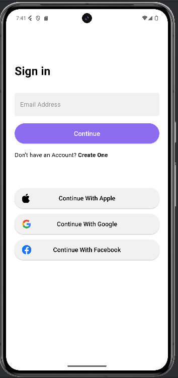
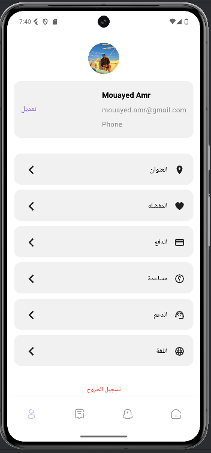
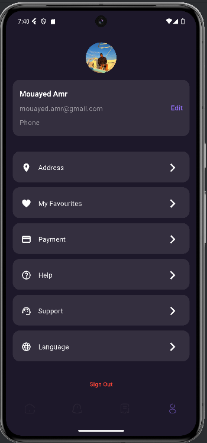
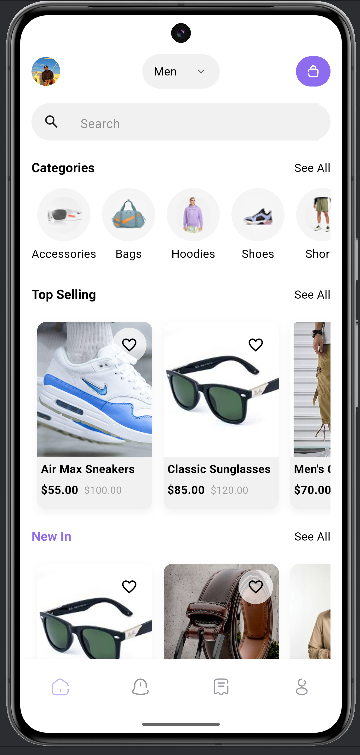
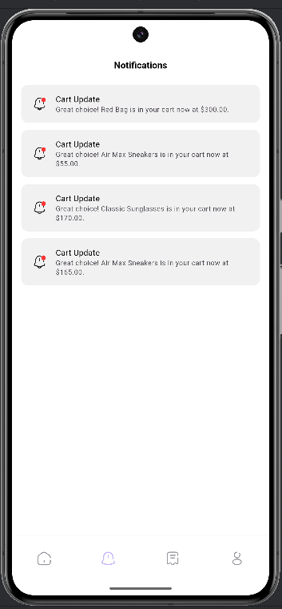
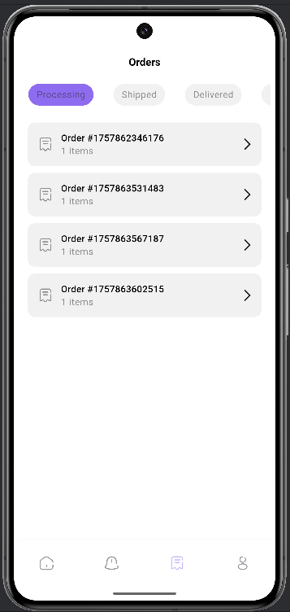
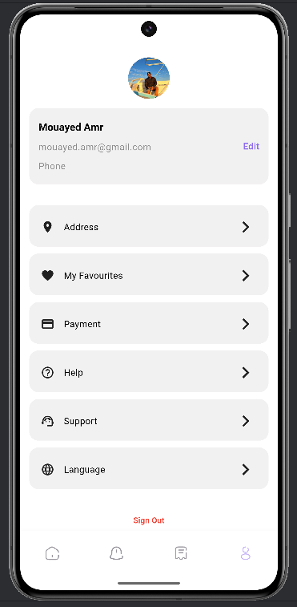

# 🛍️ Clot – E-Commerce App

Clot is a Flutter-based e-commerce mobile application developed as part of my **internship at Link Development Company**.  
The app integrates **Firebase services**, **Riverpod state management**, and supports **localization** for a seamless shopping experience.

---

## 📸 Screenshots

| Authentication                | Localization                                  | Dark Theme                           |
|-------------------------------|-----------------------------------------------|--------------------------------------|
|  |  |  |

| Home                          | Notifications                                   | Orders                            | Profile                             |
|-------------------------------|-------------------------------------------------|-----------------------------------|-------------------------------------|
|  |  |  |  |


## Demo Link: https://streamable.com/gpevbg

---

## ✨ Features

- **Firebase Authentication** – Login & registration.
- **Cloud Firestore** – Real-time database for products and orders.
- **Firebase Cloud Messaging** – Push notifications support.
- **Riverpod** – State management for scalability and maintainability.
- **Localization** – Supports **Arabic & English**.
- **Splash Screen Animation** – Smooth user onboarding.
- **Clean & Structured Codebase** – Readable and maintainable.

---

## 🛠️ Tech Stack

- **Flutter**
- **Dart**
- **Firebase Authentication**
- **Cloud Firestore**
- **Firebase Cloud Messaging**
- **Riverpod** (state management)

---

## 🚀 Getting Started

### Prerequisites
- Flutter SDK installed
- Firebase project configured

### Installation
1. Clone the repo
   ```bash
   git clone https://github.com/YoussefGhonem1/ecommerce_linkdevelpment.git
   cd clot_ecommerce_app
